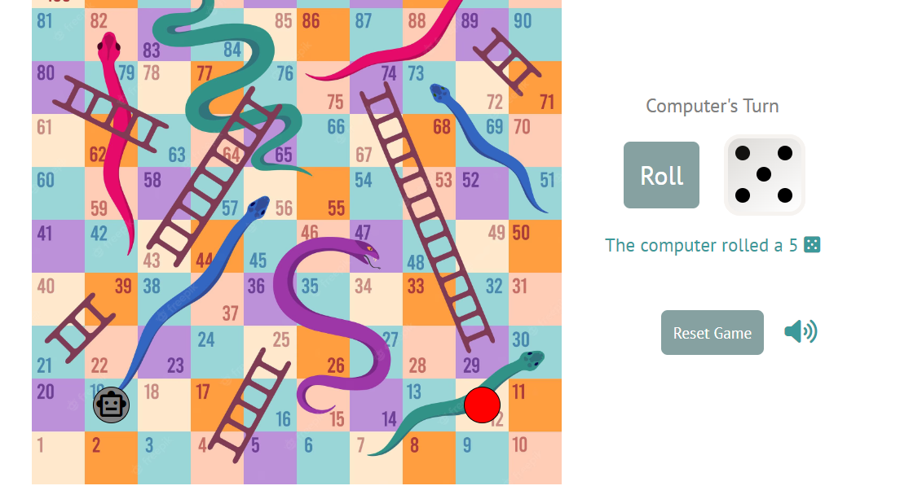
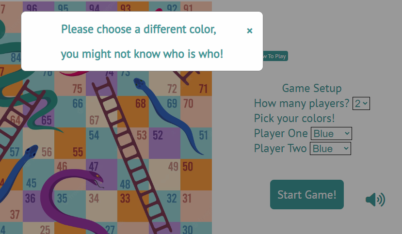
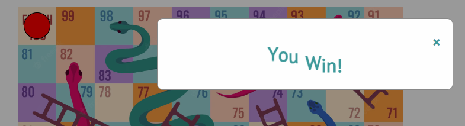

# SNAKES AND LADDERS

The Snakes and Ladders website allows users to play a game of Snakes and Ladders against another player, or against a computer-controlled opponent. Using visual, audio and interactive elements, the game provides a fun and relaxed way to play the game of Snakes and Ladders.

## UX
The aim with the user interface in this project is to provide clear and concise options to the user. The gameboard of snakes and ladders is necessarily busy and cluttered so the other elements were kept as minimal as possible.

The user is presented with the gameboard and the game setup in one screen to prevent having to scroll up and down to access options. HTML elements are added and removed depending on the game state so as to keep the game area clean and un-cluttered.

Large buttons and fonts make it easy for the user to interact with the different elements and recieve information back from them.

Color-dependent text is used to further clarify things such as turn states.

### Colour Scheme

The site uses bright, pastel colours for the gameboard elements with accented blue elements for the fonts and buttons. Player pieces are also brightly coloured, but using strong, bold primary and secondary colours so as to draw the eye of the user and allow them to instantly spot their piece on the gameboard.

- `#3d999a` used for primary text.
- `#327e80` used for primary highlights.
- `#ffe8cc` used for gameboard.
- `#ff9e40` used for gameboard.
- `#9ad6d7` used for gameboard.
- `#ffcdb6` used for gameboard.
- `#bc91d9` used for gameboard.

I used [coolors.co](https://coolors.co/e84610-009fe3-4a4a4f-445261-d63649-e6ecf0-000000) to generate my colour palette.

### Typography

Google Fonts as used for all main fonts in the site

Google Material Symbols & Icons, as well as FontAwesome were used for icons

- [Yanone Kaffeesatz](https://fonts.google.com/specimen/Yanone+Kaffeesatz) was used for the primary headers and titles.

- [PT Sans](https://fonts.google.com/specimen/PT+Sans) was used for all other secondary text.

- [Google Icons](https://fonts.google.com/icons) icons were used throughout the site

- [Font Awesome](https://fontawesome.com) icons were used throughout the site

## Features

### Existing Features

- **Game Board**

    - This is the main game area of the site. player pieces advance up the numbered squares to reach the finish square. This provides the surface for the player pieces, as well as depictions of where the snake and ladder squares are.

- **Game Setup Form**

    - This form allows the user to customize the game to their liking. A user can choose whether to play a 1-player game against a computer opponent or a 2-player game with another user. Users can also select the colour of their player piece. The form automatically changes based on whether the user selects 1 or 2 players, helping to avoid unnecessary confusion. The Start Game button provides the user with a very clear and definitive way of beginning the game.

- **Dice Roller**

    - This is the mechanism used by the user to advance their piece up the board. Once the game begins, these elements take the place of the setup form to keep all of the elements tidy and compact. A large 'Roll' button makes it easy for the user to use this feature. A rolling die image next to the button simulates the rolling of a die before displaying the result of the user's roll. This helps to add realism and satisfaction to the ordinary random number generation going on in the background. The roll button is disabled while the dice animation is playing, and also while the computer is taking their turn, avoiding risk of multiple or accidental clicks.

- **Player Pieces**

    - The player pieces are large and contrasting against the gameboard, as well as their colour being customisable, allowing the user to quickly see where on the gameboard their piece is.
    Smooth transitions were used to help the user to follow the piece along the board as it moves, as well as providing realism to the movement of the pieces. The pieces visibly climb up the ladders and slide down the snakes on the board, again hlping the user to easily visualise what is happening on the gameboard.

- **Computer Piece**

    - The computer piece functions in the same way as the player pieces, but is colored a robotic grey. A robotic face icon is also added to the piece to further clarify this piece's identity to the user.

- **1-Player Game**

    - A computer opponent is implemented in order to allow the user to play the game on their own. The computer player takes its turn automatically, without dice roll animations, in order for the user to quickly return to playing their turn.

- **2-Player Game**

    - Users can also choose to play a 2-player game via the setup form. The site will allow the users to choose their individual colors and, upon starting the game, will randomly select one or the other to take their turn first. The game will then alternate turns between the two users.

- **Color Check**

    - When a 2-player game is started, the site will perform a check to see if the players have selected the same coloured player piece. If so, the site will alert the users to this fact and ask them to pick different colours, to avoid confusion while playing. 

- **Reset Game Button**

    - This button allows the user to reset the game back to its original state. The user is prompted to confirm this action in order to avoid accidental clicks. The pieces' location is reset to the first square on the gameboard and the setup form is once again presented to the user to setup another game if they should choose. The button is disabled during turns to avoid potential bugs caused by resetting the game while pieces are moving.

- **Game Messages**

    - Game messages are presented to the user to provide information and reduce potential confusion. The user will see messages informing them of the current turn, with a color matching that player's piece. If a user is playing against a computer opponent, the computer's automatically generated dice rolls will also be displayed, along with a representative dice icon, to help the user to visualise the computer opponent's turn, but without having to watch the computer go through their own dice roll animation.

- **Background Music**

    - Background music begins automatically wheen the user starts the game. Music was not chosen to begin autoplaying on first loading of the site as this can be disabled by certain browsers. The music is easygoing and not too loud, to provide a simple background accompaniment which enhances the experience of playing the game.

- **Audio Effects**

    - The dice roller produces a real dice shaking and rolling sound to further increase the satisfaction and realism of using the dice roll element. When a piece climbs a ladder, a pleasant, rising style sound effect is played to draw the user's attention to the ladder function as well as to provide a sense of satisfaction at having landed on the ladder square. When a piece slides down a snake, a less pleasant, falling style sound effect is played.

- **Audio Mute Button**

    - This button allows the user to mute and unmute all audio from the site. Users can easily press the button at any time during all stages of the game to mute it the audio, or turn it back on. Recognisable volume and mute icons are displayed to the user, allowing them to see what state the audio mute setting is, even without using the audio itself. 

- **Rules Popup**

    - Pressing the How To Play button will cause a popup of the rules to appear. This instructs the user on how to use the various elements of the site, as well as the rules of the actual Snakes and Ladders game.

- **Win Message**

    - Upon finishing the game, a message will pop up to inform the user that the game has been won and by which player. This gives a sense of finality to the end of the game and allows the user a moment of celebration or comiseration before resetting the game state. Animated text is used in the case of a player win to aid in the celebrations.

### Future Features

- Multiple players
    - Ability to select more than two players would provide more ways to play the game.
- Multiple computer players
    - This would mean that one or more users can add multiple computer opponents to a game, increasing the challenge
- Remote play
    - Facility for users to connect and play the game remotely

## Tools & Technologies Used

- [HTML](https://en.wikipedia.org/wiki/HTML) used for the main site content.
- [CSS](https://en.wikipedia.org/wiki/CSS) used for the main site design and layout.
- [JavaScript](https://www.javascript.com/) used for auto-closing the responsive burger menu.
- [CSS Flexbox](https://www.w3schools.com/css/css3_flexbox.asp) used for an enhanced responsive layout.
- [Git](https://git-scm.com) used for version control. (`git add`, `git commit`, `git push`)
- [GitHub](https://github.com) used for secure online code storage.
- [GitHub Pages](https://pages.github.com) used for hosting the deployed front-end site.
- [Gitpod](https://gitpod.io) used as a cloud-based IDE for development.
- [Markdown Builder by Tim Nelson](https://traveltimn.github.io/markdown-builder) used to help generate the Markdown files.
- [Google Fonts](https://fonts.google.com/) used for fonts on the site.
- [Color Hexa](https://www.colorhexa.com/) used to generate contrasting and complementary colors 
- [Palette Generator](https://palettegenerator.com/) used to generate color palettes based on image colors
- [Web AIM](https://webaim.org/resources/contrastchecker/) used to check color contrast for accessibility purposes
- [Dimensions](https://chrome.google.com/webstore/detail/dimensions/baocaagndhipibgklemoalmkljaimfdj?hl=en) Chrome extension used to measure dimensions on virtual elements of site
- [Eye Dropper](https://chrome.google.com/webstore/detail/eye-dropper/hmdcmlfkchdmnmnmheododdhjedfccka?hl=en) Chrome extension used to quickly identify and work with colors
- [Pesticide](https://chrome.google.com/webstore/detail/pesticide-for-chrome/bakpbgckdnepkmkeaiomhmfcnejndkbi) Chrome extension used to illustrate borders on virtual elements
- [Cubase](https://www.steinberg.net/cubase/) DAW used to edit audio.

## Testing

For all testing, please refer to the [TESTING.md](TESTING.md) file.

## Deployment

The site was deployed to GitHub Pages. The steps to deploy are as follows:
- In the [GitHub repository](https://github.com/LewisMDillon/snakes-and-ladders), navigate to the Settings tab 
- From the source section drop-down menu, select the **Main** Branch, then click "Save".
- The page will be automatically refreshed with a detailed ribbon display to indicate the successful deployment.

The live link can be found [here](https://lewismdillon.github.io/snakes-and-ladders)

### Local Deployment

This project can be cloned or forked in order to make a local copy on your own system.

#### Cloning

You can clone the repository by following these steps:

1. Go to the [GitHub repository](https://github.com/LewisMDillon/snakes-and-ladders) 
2. Locate the Code button above the list of files and click it 
3. Select if you prefer to clone using HTTPS, SSH, or GitHub CLI and click the copy button to copy the URL to your clipboard
4. Open Git Bash or Terminal
5. Change the current working directory to the one where you want the cloned directory
6. In your IDE Terminal, type the following command to clone my repository:
	- `git clone https://github.com/LewisMDillon/snakes-and-ladders.git`
7. Press Enter to create your local clone.

Alternatively, if using Gitpod, you can click below to create your own workspace using this repository.

Please note that in order to directly open the project in Gitpod, you need to have the browser extension installed.
A tutorial on how to do that can be found [here](https://www.gitpod.io/docs/configure/user-settings/browser-extension).

#### Forking

By forking the GitHub Repository, we make a copy of the original repository on our GitHub account to view and/or make changes without affecting the original owner's repository.
You can fork this repository by using the following steps:

1. Log in to GitHub and locate the [GitHub Repository](https://github.com/LewisMDillon/snakes-and-ladders)
2. At the top of the Repository (not top of page) just above the "Settings" Button on the menu, locate the "Fork" Button.
3. Once clicked, you should now have a copy of the original repository in your own GitHub account!

## Credits

### Content

| Source | Location | Notes |
| --- | --- | --- |
| [Markdown Builder](https://traveltimn.github.io/markdown-builder) | README and TESTING | tool to help generate the Markdown files |
| [Chris Beams](https://chris.beams.io/posts/git-commit) | version control | "How to Write a Git Commit Message" |
| [W3Schools](https://www.w3schools.com/tags/av_prop_muted.asp) | entire site | how to mute and unmute audio |
| [W3Schools](https://www.w3schools.com/howto/howto_css_modals.asp) | entire site | how create a modal |
| [Coding Gem](https://www.codingem.com/javascript-get-html-element-position/) | game board | Retrieve the position (X,Y) of an HTML element |
| [Geeks for geeks](https://www.codingem.com/javascript-get-html-element-position/) | form buttons | How to add a pressed effect on button click in CSS |
| [Stack Overflow](https://stackoverflow.com/questions/9437228/html5-check-if-audio-is-playing) | entire site | HTML5 how to check if audio is playing |
| [Stack Overflow](https://stackoverflow.com/questions/12836227/change-select-box-option-background-color) | setup form | Change select box option background color|
| [Flexbox Froggy](https://flexboxfroggy.com/) | entire site | modern responsive layouts |
| [Youtube](https://www.youtube.com/watch?v=-loiv1gU50M) | game functionality | How to Code Snakes and Ladders with Javascript |
| [Youtube](https://www.youtube.com/watch?v=dcRqXrl5804) | game functionality | Snakes and Ladders Game |
| [Youtube](https://www.youtube.com/watch?v=XTF5jXDr2H8) | Dice roll animation | Roll Dice Project using CSS & JavaScript |

### Media
| Source | Location | Type | Notes |
| --- | --- | --- | --- |
| [Freepik](https://wallhere.com) | game board | image | game board image |
| [Flaticon](https://www.flaticon.com/free-icon/dice_7262385?term=dice&page=1&position=8&origin=tag&related_id=7262385) | entire site | image | favicon image |
| [Freesound](https://freesound.org/people/SciFiSounds/sounds/547928/) | entire site | audio | dice roll sound |
| [Pixabay](https://pixabay.com/sound-effects/) | entire site | audio | free game sounds |
| [Chosic](https://www.chosic.com/download-audio/29284/) | entire site | audio | background music |
| [TinyPNG](https://tinypng.com) | entire site | image | tool for image compression |

### Acknowledgements

- I would like to thank my Code Institute mentor, [Tim Nelson](https://github.com/TravelTimN) for their support throughout the development of this project.
- I would like to thank the [Code Institute](https://codeinstitute.net) tutor team for their assistance with troubleshooting and debugging some project issues.
- I would like to thank the [Code Institute Slack community](https://code-institute-room.slack.com) for the moral support; it kept me going during periods of self-doubt and imposter syndrome.
- I would like to thank my partner Rachel, for believing in me, and for playing this game with me many many times.
