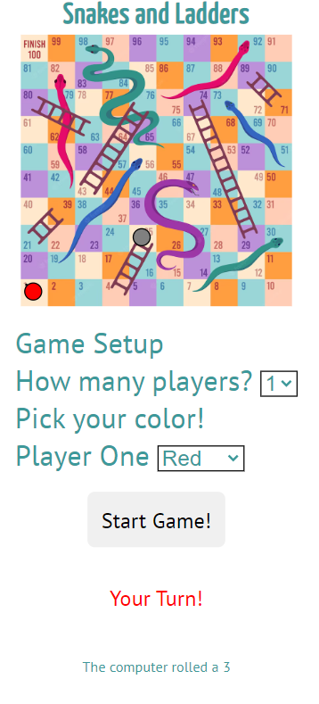

# Testing

Return back to the [README.md](README.md) file.

## Code Validation

### HTML

I have used the recommended [HTML W3C Validator](https://validator.w3.org) to validate all of my HTML files.

| Page | W3C URL | Screenshot | Notes |
| --- | --- | --- | --- |
| Home | [W3C](https://validator.w3.org/nu/?doc=https%3A%2F%2FLewisMDillon.github.io%2Fsnakes-and-ladders%2Findex.html) |  | Pass: No Errors |

### CSS

I have used the recommended [CSS Jigsaw Validator](https://jigsaw.w3.org/css-validator) to validate all of my CSS files.

| File | Jigsaw URL | Screenshot | Notes |
| --- | --- | --- | --- |
| style.css | [Jigsaw](https://jigsaw.w3.org/css-validator/validator?uri=https%3A%2F%2FLewisMDillon.github.io%2Fsnakes-and-ladders) |  | Pass: No Errors |

### JavaScript

I have used the recommended [JShint Validator](https://jshint.com) to validate all of my JS files.

| File | Screenshot | Notes |
| --- | --- | --- |
| script.js |  | Pass: No Errors |

## Browser Compatibility

I've tested my deployed project on multiple browsers to check for compatibility issues.

| Browser | Screenshot | Notes |
| --- | --- | --- |
| Chrome |  | Works as expected |
| Firefox |  | Works as expected |
| Edge |  | Works as expected |
| Safari |  | Minor CSS differences |
| Brave |  | Works as expected |
| Opera |  | Works as expected |
| Internet Explorer |  | Completely broken grid elements |

## Responsiveness

I've tested my deployed project on multiple devices to check for responsiveness issues.

| Device | Screenshot | Notes |
| --- | --- | --- |
| Mobile (DevTools) |  | Works as expected |
| Tablet (DevTools) |  | Works as expected |
| Desktop |  | Works as expected |
| XL Monitor |  | Scaling starts to have minor issues |
| 4K Monitor |  | Noticeable scaling issues |
| Oneplus Nord 2 |  | Works as expected |
| iPhone 14 |  | Works as expected |

## Lighthouse Audit

I've tested my deployed project using the Lighthouse Audit tool to check for any major issues.

| Page | Size | Screenshot | Notes |
| --- | --- | --- | --- |
| Home | Mobile |  | Some minor warnings |
| Home | Desktop |  | Some minor warnings |

## Defensive Programming

Defensive programming was manually tested with the below user acceptance testing:

| Page | User Action | Expected Result | Pass/Fail | Comments |
| --- | --- | --- | --- | --- |
| Home Page - Game Setup | | | | |
| | Click on How To Play button | Pop up rules modal | Pass | |
| | Change players to 2 | Expand Form | Pass | |
| | Click on Start Game | Check Player Colors | Pass | |
| | Click on Start Game | Start Game | Pass | |
| | Click on audio icon | Toggle audio mute/unmute | Pass | |
| Home Page - Game Running | | | | |
| | Click on Roll Button | Roll dice | Pass | |
| | Click on Roll Button | Move Player Piece | Pass | |
| | Click on Roll Button | Run computer's turn | Pass | |
| | Click on Roll Button | Run computer's turn | Pass | |
| | Click on Reset Game Button | Popup reset confirmation modal | Pass | |
| | Click on Reset-Cancel Button | Cancel reset, return to game | Pass | |
| | Click on Reset-Confirmation Button | Reset Game State | Pass | |

## Bugs

- Player pieces are not moving along the rows and columns of the grid in the expected way - pieces are jumping up rows when they shouldn't.

    

    - Fixed this issue by re-coding the javascript function which dictates piece movement. Dice roll is now added to row-column-start.

- Grid disappearing in certain game states

    

    - Fixed this issue by removing syntax error in JS

- The game is resetting before the user has a chance to click ok on the reset alert

    

    - Fixed this issue by removing duplicate reset function calls in JS

- Functions are not executing in the order expected - dice roll function should execute before switch turn function

    

    - Fixed this issue by removing extra function call from inside switch turn function

- The switch turn function changes the player turn from 1 to 2 successfully, but does not change back from turn 2 to turn 1

    

    - Fixed this issue by fixing syntax error in JS (needed pair of brackets after switch turn function call)

- Clicking on the roll button twice in quick succession will case the player piece to move twice before the turn can be switched

    

    - Fixed this issue by disabling the roll button after click, then re-enabling on turn switch

- Clicking the reset game button during a turn will reset the game, but then the functions to move the pieces will keep executing and move the pieces from the reset position

    

    - Fixed this issue by disabling the reset button during turns

### GitHub **Issues**

**Fixed Bugs**

All previously closed/fixed bugs can be tracked [here](https://github.com/LewisMDillon/snakes-and-ladders/issues?q=is%3Aissue+is%3Aclosed).

| Bug | Status |
| --- | --- |
| [Player pieces are not moving along the rows and columns of the grid in the expected way - pieces are jumping up rows when they shouldn't.](https://github.com/LewisMDillon/snakes-and-ladders/issues/1) | Closed |
| [Grid disappearing in certain game states](https://github.com/LewisMDillon/snakes-and-ladders/issues/2) | Closed |
| [The game is resetting before the user has a chance to click ok on the reset alert](https://github.com/LewisMDillon/snakes-and-ladders/issues/3) | Closed |
| [Functions are not executing in the order expected - dice roll function should execute before switch turn function](https://github.com/LewisMDillon/snakes-and-ladders/issues/2) | Closed |
| [The switch turn function changes the player turn from 1 to 2 successfully, but does not change back from turn 2 to turn 1](https://github.com/LewisMDillon/snakes-and-ladders/issues/2) | Closed |
| [Clicking on the roll button twice in quick succession will case the player piece to move twice before the turn can be switched](https://github.com/LewisMDillon/snakes-and-ladders/issues/2) | Closed |
| [Clicking the reset game button during a turn will reset the game, but then the functions to move the pieces will keep executing and move the pieces from the reset position](https://github.com/LewisMDillon/snakes-and-ladders/issues/2) | Closed |

**Open Issues**

Any remaining open issues can be tracked [here](https://github.com/LewisMDillon/snakes-and-ladders/issues).

## Unfixed Bugs

There are no remaining bugs that I am aware of.
